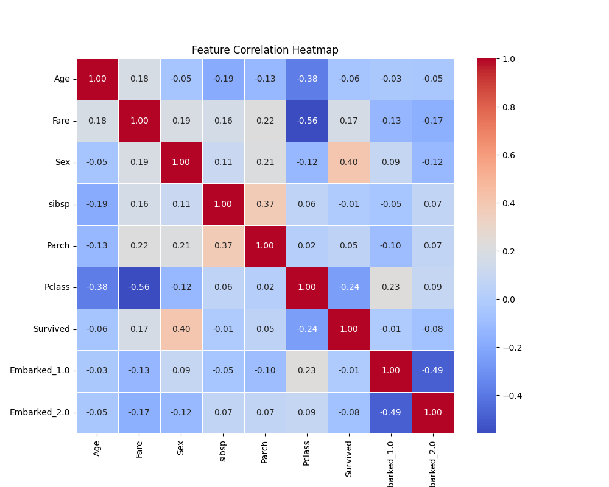

# 🚢 Titanic Survival Prediction using Machine Learning

## 📌 Project Overview

This project predicts whether a passenger survived the Titanic disaster using **Machine Learning**.
The model is trained using **Logistic Regression** and demonstrates a complete **ML pipeline including data preprocessing, visualization, training, evaluation, and model persistence**.

The project also includes **data exploration and correlation analysis** to understand relationships between features.

---

# 📊 Dataset Information

The dataset contains passenger details such as:

* Age
* Fare
* Gender
* Passenger Class
* Number of Siblings/Spouses
* Number of Parents/Children
* Embarkation Port

**Target Variable**

* `Survived`

  * 1 → Survived
  * 0 → Did Not Survive

---

# ⚙️ Technologies Used

| Technology   | Purpose                |
| ------------ | ---------------------- |
| Python       | Programming Language   |
| Pandas       | Data manipulation      |
| NumPy        | Numerical operations   |
| Matplotlib   | Data visualization     |
| Seaborn      | Advanced visualization |
| Scikit-learn | Machine Learning       |
| Joblib       | Model persistence      |

---

# 🧠 Machine Learning Workflow

```
Titanic Dataset
      ↓
Data Exploration
      ↓
Data Cleaning & Preprocessing
      ↓
Feature Engineering
      ↓
Train-Test Split
      ↓
Logistic Regression Model
      ↓
Model Evaluation
      ↓
Model Persistence
```

---

# 📈 Correlation Heatmap

The correlation heatmap helps visualize relationships between different features in the dataset.



Key Observations:

* **Sex strongly influences survival**
* **Passenger class impacts survival probability**
* **Age has a slight negative correlation with survival**

---

# 🤖 Model Used

### Logistic Regression

Logistic Regression is a **classification algorithm** used to predict binary outcomes.

In this project it predicts:

```
0 → Passenger Did Not Survive
1 → Passenger Survived
```

---

# 📊 Model Performance

**Accuracy**

```
76.71%
```

**Confusion Matrix**

```
[[174 46]
 [15 27]]
```

Interpretation:

* 174 passengers correctly predicted as **did not survive**
* 27 passengers correctly predicted as **survived**
* 46 incorrect survival predictions
* 15 missed survival predictions

---

# 📂 Project Structure

```
Machine-Learning-Titanic-Survival-Prediction
│
├── Dataset
│   └── TitanicDataset.csv
│
├── Titanic_Survival_Prediction.py
│
├── correlation_heatmap.png
│
├── Titanic.pkl
│
└── README.md
```

---

# ▶️ How to Run the Project

### 1️⃣ Install Dependencies

```
pip install pandas numpy matplotlib seaborn scikit-learn joblib
```

### 2️⃣ Run the Script

```
python Titanic_Survival_Prediction.py
```

---

# 📌 Key Insights

* **Gender plays a major role in survival prediction**
* **First class passengers had higher survival probability**
* **Passengers traveling with large families had lower survival rates**

---

# 🔮 Future Improvements

Possible improvements for this project:

* Add **Decision Tree and Random Forest models**
* Compare **multiple ML algorithms**
* Perform **feature importance analysis**
* Deploy the model using **Flask or Streamlit**
* Create an **interactive dashboard**

---

# 👨‍💻 Author

**Shubham Nanasaheb Dalvi**

Machine Learning & Data Analytics Enthusiast


